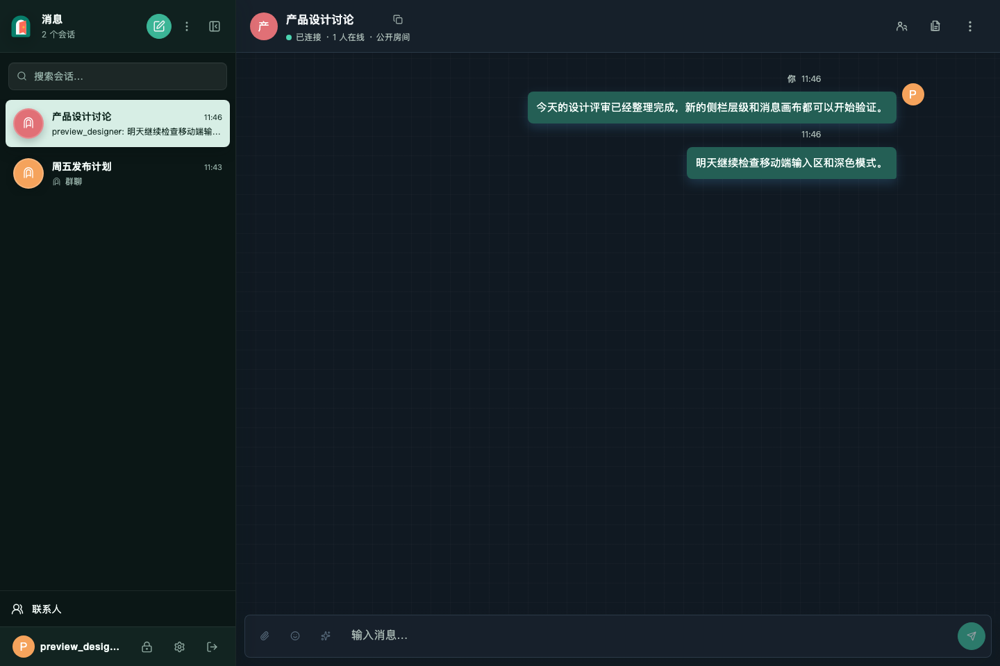
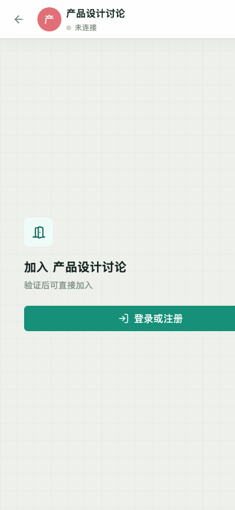

# Echo Gate

<p align="center">
  
</p>

Echo Gate is a room-centered communication system for teams and private groups.
It combines real-time chat, direct conversations, durable attachments, personal
favorites, room-scoped AI workspaces, and native desktop access in one
self-hosted service.



## What is included

- Public and private rooms, direct conversations, contacts, invitations, and
  room-level roles.
- Real-time messages, replies, edits, recalls, reactions, mentions, forwarding,
  read state, and resumable attachment uploads.
- Personal favorites and folders for messages, files, links, and notes.
- Optional AI suggestions and independent AI threads with durable runs,
  citations, and room-authorized retrieval.
- Vue browser client and a PySide6 desktop client backed by the same Rust API.
- SQLite for a minimal local deployment or PostgreSQL, Redis, Qdrant, and OSS
  for larger deployments.

## Quick start with SQLite

Install a current stable Rust toolchain and [Bun](https://bun.sh/), then run:

```sh
cargo run --bin server -- \
  --config ./echo-gate.local.toml \
  --database-type sqlite \
  --database ./echo-gate.db
```

`echo-gate.local.toml` is intentionally absent: a missing configuration file
selects the safe built-in defaults. The first build installs the locked browser
dependencies and embeds the production web bundle. Open
`http://127.0.0.1:3000`, register an account, and create a room. This path does
not require PostgreSQL, Redis, Qdrant, object storage, an AI provider, or any
secret.

For a local multi-service environment, start the infrastructure and run the
server on the host:

```sh
docker compose -f docker-compose.local.yaml up -d
cargo run --bin server
```

The production container layout is documented in
[docs/container-deployment.md](docs/container-deployment.md).

## Architecture

```text
Vue web client ----------- HTTP / WebSocket -----------+
PySide6 desktop client --- HTTP / WebSocket -----------+--> Axum domain modules
                                                          |       |
                                                          |       +--> SQLite or PostgreSQL
                                                          |       +--> local files or OSS
                                                          |       +--> optional Redis cache
                                                          |       +--> optional AI + Qdrant
                                                          +--> embedded web assets
```

`Room` is the authorization and knowledge-isolation boundary. Relational data
and original messages are the source of truth; caches, vectors, notifications,
summaries, and AI output are projections that are re-authorized before use.
See [CONTEXT.md](CONTEXT.md) and
[docs/product-roadmap-and-agent-plan.md](docs/product-roadmap-and-agent-plan.md)
for the domain vocabulary and delivery plan. The completed foundation wave is
recorded in
[docs/archive/foundation-fnd-001-004.md](docs/archive/foundation-fnd-001-004.md).

## Configuration

The server loads `.env`, reads `chat-room.toml` (or `--config PATH`), and then
applies `CHAT_ROOM_*` environment overrides. Do not put provider keys or other
real secrets in committed TOML files. The complete field reference, precedence
rules, database options, and storage behavior live in
[docs/configuration.md](docs/configuration.md); `.env.example` lists supported
environment variables with non-secret development defaults.

Echo Gate is the product and display name. The repository, Rust crate,
configuration filename, `CHAT_ROOM_*` variables, and `echo-chat` desktop entry
point keep their existing technical names for compatibility.

## Verification

Run the release checks that match your change:

```sh
cargo fmt --all -- --check
cargo clippy --all-targets --all-features -- -D warnings
cargo test --all-targets --all-features

cd web
bun test
bun run typecheck
bun run build

cd ../desktop
uv run pytest
uv run ruff check src tests
uv run ruff format --check src tests main.py
```

Migration parity, upgrade coverage, source-file size limits, real PostgreSQL
tests, and the complete CI release gate are described in
[docs/product-roadmap-and-agent-plan.md](docs/product-roadmap-and-agent-plan.md).

## Clients

- [Browser client](web/README.md)
- [Desktop client](desktop/README.md)
- [Brand and interface system](design/README.md)

<p align="center">
  
</p>
