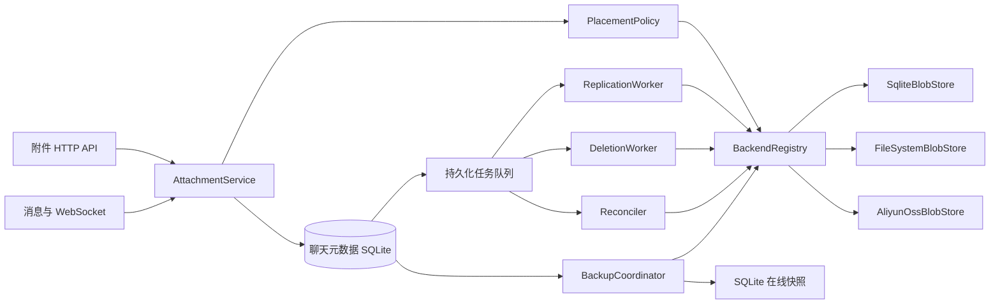

# 聊天附件多后端存储与备份演进计划

> 状态：本地文件系统、阿里云 OSS 主存储、SHA-256 内容寻址与保留期清理已完成；副本与灾备仍在规划中
> 适用范围：聊天中的图片、视频和普通文件附件  
> 当前基线：SQLite/PostgreSQL 保存附件元数据，完整二进制流式写入本地目录或 OSS

## 1. 背景

第一阶段已经移除完整文件入内存和 SQLite BLOB 链路。上传按 multipart chunk 写入 staging，
增量计算 SHA-256 后发布到本地文件系统或 OSS；下载使用流式响应并支持 HTTP Range。迁移会先
把旧 `attachments.data` 导出成功，再删除该列。当前实现还会复用相同哈希的物理对象，并在最后
一个活动消息引用消失后标记孤儿数据，由管理员按保留期显式清理。仍需继续解决：

- 尚未为同一附件维护多个在线副本，也未实现自动故障切换。
- 在线副本、历史备份、校验、恢复和存储迁移尚未形成独立机制。
- 本地文件/OSS 和数据库元数据的跨介质事务目前依靠幂等发布与保留期清理，尚无持久任务状态机。

本计划将二进制存储从消息持久化中抽象出来，同时保留 SQLite 作为一种正式支持的附件
存储后端。目标不是立即替换当前实现，而是建立可以分阶段演进、验证和回滚的架构。

## 2. 目标与非目标

### 2.1 目标

1. 支持下列主存储和副本存储，可通过配置组合，不修改聊天业务代码：
   - SQLite Blob 存储；
   - 本地文件系统；
   - 阿里云 OSS；
   - 后续的 S3、MinIO、其他云对象存储或自定义后端。
2. 上传和下载全链路流式处理，内存占用保持有界，并继续支持 HTTP Range。
3. 一个附件可以有一个权威主位置和零到多个只读副本。
4. 在线副本与灾难恢复备份分开设计，支持多个备份目标、保留策略和恢复校验。
5. 外部存储与 SQLite 无法共享事务时，仍能通过状态机、幂等任务和对账实现最终一致。
6. 保持现有附件 API、消息格式和 WebSocket 广播格式兼容。
7. 支持从当前 `attachments.data` 平滑迁移，并在校验完成前保留回滚路径。
8. 所有附件均具备大小、SHA-256、存储状态和可审计的副本信息。

### 2.2 非目标

- 第一阶段不实现跨地域强一致或多主写入。
- 不把 OSS、本地文件和 SQLite 暴露成不同的业务 API。
- 不依赖原始文件名作为物理对象键；内容去重只复用物理字节，不合并权限和附件元数据。
- 不在对象存储阶段改变现有 TOML 上传大小策略。
- 不将在线副本当作可恢复备份，也不以数据库文件复制代替 SQLite 在线备份。

## 3. 核心设计决策

### 3.1 元数据是控制面，二进制存储是数据面

聊天主 SQLite 数据库继续保存附件身份、权限、消息关联、校验和与位置状态，但不要求保存
附件内容。每个具体后端只关心不透明的对象键和字节流。

### 3.2 一个权威主位置，多个只读副本

每个附件只有一个逻辑上的 `primary` 位置。默认写入策略是“主位置持久化成功即可响应”，
其他位置由后台任务异步复制。后续可以增加同步副本数量或写入 quorum，但不得形成多个可独立
修改的主位置。

读取顺序由策略决定，通常先读主位置，失败时读已校验副本。读取副本成功后可以触发修复任务，
但自动切换不得悄悄改写主位置；永久提升副本必须形成持久化、可审计的状态变更。

### 3.3 在线副本和备份是两种能力

- **在线副本**：逐附件复制，服务于可用性、读取降级和后端迁移，会跟随删除生命周期。
- **灾备备份**：某个时间点的元数据快照、附件清单和对象内容，具备独立保留周期，不能因
  线上误删立即消失。

二者可以复用底层 `BlobStore`，但任务表、命名空间、保留策略、权限和恢复流程必须分开。

### 3.4 不把外部存储伪装成数据库事务

本地文件和 OSS 无法与 SQLite 原子提交。上传、复制、删除采用状态机和 Saga：每一步幂等，
崩溃后由后台协调器继续或补偿。只有状态为 `ready` 的附件才能出现在消息历史和广播中。

### 3.5 配置中的后端 ID 是持久标识

元数据只保存 `backend_id` 和 `object_key`，不保存凭证。`backend_id` 一旦产生数据就不能指向
另一种存储或另一桶数据。后端改名应通过迁移完成，不能直接复用旧 ID。

## 4. 目标架构



建议的代码边界：

```text
src/
  attachments/
    mod.rs                 # 对业务暴露的 AttachmentService
    domain.rs              # 状态、对象键、Range、错误等领域类型
    repository.rs          # 附件元数据和任务表访问
    placement.rs           # 新附件放置和读取顺序策略
    upload.rs              # 上传 Saga
    download.rs            # 鉴权、Range 和流式响应
    deletion.rs            # tombstone 与异步物理删除
    reconcile.rs           # 校验、缺失检测和自动修复
  blob_store/
    mod.rs                 # BlobStore trait、BackendRegistry
    sqlite.rs
    filesystem.rs
    aliyun_oss.rs
  backup/
    mod.rs
    coordinator.rs
    manifest.rs
    restore.rs
  bin/
    storage_worker.rs      # 可先与 server 同进程，之后可独立部署
    storage_admin.rs       # migrate/verify/backup/restore 管理命令
```

`message_store.rs` 只负责消息和附件元数据关联，不再读写二进制内容。HTTP handler 只负责协议、
鉴权和参数验证，具体存储行为由 `AttachmentService` 完成。

## 5. 存储接口

接口必须以流为边界，禁止在通用层使用 `Vec<u8>` 表示完整文件。以下为意图示例，具体类型可在
实现时按 Axum/Tokio 版本调整：

```rust
pub trait BlobStore: Send + Sync {
    fn id(&self) -> &BackendId;
    fn capabilities(&self) -> StoreCapabilities;

    async fn put(
        &self,
        key: &ObjectKey,
        body: ByteStream,
        options: PutOptions,
    ) -> Result<PutReceipt, StoreError>;

    async fn head(&self, key: &ObjectKey) -> Result<Option<ObjectMetadata>, StoreError>;

    async fn get(
        &self,
        key: &ObjectKey,
        range: Option<ByteRange>,
    ) -> Result<Option<GetResult>, StoreError>;

    async fn delete(&self, key: &ObjectKey) -> Result<DeleteResult, StoreError>;
    async fn health_check(&self) -> Result<HealthStatus, StoreError>;
}
```

接口约束：

- `put` 使用预先生成的稳定对象键，并携带幂等键；同一次上传重试不能生成重复对象。
- `put` 返回实际大小、SHA-256、后端版本号或 ETag，但 ETag 不得被当作通用内容校验和。
- `get` 返回流和明确的实际范围，不把完整对象加载到内存。
- `delete` 必须幂等，对不存在的对象返回成功语义。
- `head` 和 `get` 必须能区分“不存在”“暂时不可用”“权限/配置错误”和“数据损坏”。
- 统一错误类型需要标明 `retryable`，后台任务不能靠字符串判断是否重试。
- 通用接口不强制 `list`。线上对象清单以元数据数据库为准，后端扫描作为可选管理能力。
- 后端特有能力通过 `StoreCapabilities` 声明，例如原生 Range、服务端复制、版本控制、
  预签名下载和对象锁。

`BackendRegistry` 在启动时完成配置校验并按 ID 提供 `Arc<dyn BlobStore>`。业务层不得直接匹配
`sqlite`、`filesystem` 或 `oss` 类型。

## 6. 后端实现要求

### 6.1 SQLite Blob 后端

SQLite 仍是受支持的一等后端，而不是只为兼容遗留数据保留。建议支持两种配置：

- 与聊天元数据共用数据库文件，适合最简单的单文件部署；
- 使用独立的附件 SQLite 文件，避免聊天元数据数据库随附件膨胀。

新实现应采用可流式读写的专用表。若所选驱动不能可靠使用 SQLite incremental BLOB I/O，
可以使用固定大小分块表，例如 `blob_objects` + `blob_chunks`，默认块大小 1 MiB。Range 读取只查询
覆盖区间的块。写入需在单个事务内提交对象记录和全部块，失败后不能留下可见的半对象。

运维要求：

- 设置独立连接池和 busy timeout，避免附件连接耗尽消息连接池。
- 明确 WAL、checkpoint、`VACUUM`/增量 vacuum 和最大数据库大小策略。
- 备份必须使用 SQLite Online Backup API 或等价一致性快照，不能在运行时只复制 `.db` 文件。
- SQLite 后端的 `backend_id` 绑定到规范化数据库路径或部署卷，不允许无提示换库。

### 6.2 本地文件系统后端

对象键使用服务端计算的 SHA-256，不使用原始文件名。当前布局：

```text
<root>/objects/v1/ab/cd/<sha256>
<root>/staging/<upload-id>.part
```

实现要求：

- 根目录启动时转换为规范路径，拒绝 `..`、绝对对象键和符号链接逃逸。
- 临时文件与最终文件位于同一文件系统；写入、`fsync` 后使用原子 rename 发布。
- 文件和目录使用最小权限，原始文件名只保存在元数据数据库。
- Range 下载使用 seek + take，不能读取整个文件。
- 启动时检查目录可写性和剩余空间；磁盘空间不足需要成为不可重试或延迟重试的明确错误。
- 本地后端适用于单实例或共享持久卷。多实例使用本地临时盘时不得把它配置为唯一主存储。

### 6.3 阿里云 OSS 后端

OSS 使用独立适配器，不能把云厂商细节泄漏到业务层。对象键建议为：

```text
<configured-prefix>/objects/v1/<sha256>
```

实现要求：

- 支持普通上传和分片上传；分片大小、并发度、超时和重试可配置。
- 上传失败或进程崩溃后，定期清理未完成的 multipart upload。
- 使用 SDK 默认凭证链或环境变量/工作负载身份，配置文件不得保存明文密钥。
- 支持服务端加密、HTTPS、Bucket 私有访问和最小权限 RAM 策略。
- 将 SHA-256 写入对象自定义元数据，并在后台抽样下载校验；不能假设 OSS ETag 等于 MD5。
- 默认由聊天服务鉴权并代理下载。以后可选择鉴权后返回短时效签名 URL，但必须评估访问密钥
  泄漏、缓存、Range、撤回消息和审计语义。
- OSS 临时错误、限流、签名错误、对象不存在和校验失败必须映射到统一错误类型。

### 6.4 后续对象存储

S3、MinIO 或其他云后端通过新增适配器接入。实现前应先运行同一套存储契约测试，禁止为新后端
在 `AttachmentService` 中添加条件分支。是否采用通用对象存储库应在实施时根据 OSS 的协议兼容
程度、流式能力、Range、multipart、签名和维护状态重新评估。

## 7. 元数据模型

建议将附件元数据、物理位置和作业拆开。字段名称可在实现迁移前调整，但以下语义必须保留。

### 7.1 `attachments`

| 字段 | 说明 |
| --- | --- |
| `id` | 对外稳定 UUID |
| `access_key_hash` | 下载 capability 的哈希；不再明文保存长期访问 key |
| `room_id` / `uploader_id` | 权限与归属 |
| `file_name` / `mime_type` | 展示元数据，MIME 由服务端归一化 |
| `size_bytes` | 已确认的实际大小 |
| `sha256` | 跨后端统一内容校验和 |
| `state` | `pending`、`ready`、`deleting`、`deleted`、`failed`、`quarantined` |
| `storage_policy_id` | 创建时采用的放置策略，便于审计和后续迁移 |
| `created_at` / `ready_at` / `deleted_at` | 生命周期时间 |

`messages.attachment_id` 继续引用 `attachments.id`。只有 `attachments.state = 'ready'` 且消息未
撤回时才能生成可下载附件。

### 7.2 `attachment_locations`

| 字段 | 说明 |
| --- | --- |
| `id` | 位置 UUID |
| `attachment_id` | 逻辑附件 |
| `backend_id` | 配置中不可复用的后端 ID |
| `object_key` | 后端内不透明对象键 |
| `role` | `primary` 或 `replica` |
| `state` | `pending`、`copying`、`ready`、`missing`、`corrupt`、`deleting`、`deleted`、`failed` |
| `size_bytes` / `sha256` | 该位置最后一次确认的内容信息 |
| `etag` / `version_id` | 后端特有版本信息，可空 |
| `last_verified_at` | 最近完整或抽样校验时间 |
| `attempt_count` / `last_error_code` | 运维与重试依据，不记录敏感错误正文 |
| `created_at` / `updated_at` | 审计时间 |

约束：一个附件只能有一个非删除状态的 `primary`；同一附件在同一后端默认只能有一个活动位置；
`backend_id + object_key` 全局唯一。

### 7.3 `storage_backend_catalog`

保存曾经使用过的后端 ID、类型、非敏感配置指纹、创建时间和停用时间。它不保存凭证，作用是
阻止配置误用旧 ID，并让恢复工具能发现缺失后端。

### 7.4 `storage_jobs`

持久化复制、删除、校验、修复和迁移任务：

- `job_type`：`replicate`、`delete`、`verify`、`repair`、`migrate`；
- `attachment_id`、源位置、目标后端；
- `state`、`attempt_count`、`next_attempt_at`、租约 owner 和租约到期时间；
- 唯一幂等键，避免重复 enqueue；
- 最后错误码和截断后的非敏感摘要。

工作进程使用带租约的领取方式，进程崩溃后任务可被其他实例继续。采用指数退避和随机抖动，
区分永久失败与可重试失败，并提供 dead-letter/人工重试入口。

### 7.5 备份元数据

使用独立的 `backup_runs` 与 `backup_artifacts` 记录计划、快照时间、manifest 版本、目标、状态、
对象数量、总字节数、校验结果和恢复演练结果。备份对象不写入 `attachment_locations`，避免备份
被在线删除流程清理。

## 8. 配置模型

当前 TOML 已支持上传大小、本地附件目录和单一 OSS 主存储。以下是后续多副本、策略和敏感字段
引用的目标结构，不是当前可直接使用的配置：

```toml
version = 1

[storage]
default_policy = "standard"
staging_dir = "./data/staging"
max_upload_bytes = 52428800

[storage.backends.sqlite_legacy]
type = "sqlite"
database_path = "./data/attachment-blobs.db"

[storage.backends.sqlite_archive]
type = "sqlite"
database_path = "/mnt/backup/chat-room-backups.db"

[storage.backends.local_primary]
type = "filesystem"
root = "./data/attachments"

[storage.backends.oss_backup]
type = "aliyun_oss"
endpoint = "https://oss-cn-hangzhou.aliyuncs.com"
bucket = "chat-room-private"
prefix = "production"
access_key_id_env = "CHAT_ROOM_OSS_ACCESS_KEY_ID"
access_key_secret_env = "CHAT_ROOM_OSS_ACCESS_KEY_SECRET"
server_side_encryption = "AES256"

[storage.policies.standard]
primary = "local_primary"
replicas = ["oss_backup"]
write_ack = "primary"
read_order = ["local_primary", "oss_backup"]

[[backup.plans]]
id = "daily"
schedule = "0 3 * * *"
destinations = ["oss_backup"]
prefix = "backups/daily"
include_metadata = true
include_blobs = true
retention_days = 30

[[backup.plans]]
id = "weekly-local"
schedule = "0 4 * * 0"
destinations = ["sqlite_archive"]
prefix = "backups/weekly"
include_metadata = true
include_blobs = true
retention_days = 90
```

配置校验必须在服务接受流量前完成：

- 所有策略引用的后端存在且未停用；
- 主后端可写，副本和备份目标具备所需能力；
- 备份目标不与同一数据的在线主位置或副本共享数据库文件、挂载卷或 Bucket prefix；
- 路径不重叠，staging 目录不位于不可持久化位置；
- 已有 `backend_id` 的配置指纹没有发生危险变化；
- 必需凭证存在，但凭证值不能输出到日志或管理 API；
- 至少有一个能读取现有 `ready` 附件的位置，除非显式进入恢复模式。

首个版本只实现固定默认策略；按房间、MIME、大小、用户等级路由可以后续加入
`PlacementPolicy`，而无需改变存储接口或元数据模型。

## 9. 关键流程

### 9.1 上传

1. 完成用户、房间权限、文件名和请求大小校验。
2. 生成 `attachment_id`、最终 `object_key` 和上传幂等键。
3. 在元数据事务中创建 `pending` 附件和主位置，不创建消息，也不对其他用户可见。
4. 将请求体流式送入主后端，同时增量计算 SHA-256 和实际字节数；必要时经过有界 staging 文件。
5. 校验非空、大小上限、后端回执与本地计算结果。
6. 在一个元数据事务中将附件及主位置设为 `ready`、创建消息并写入副本任务。
7. 事务提交后才进行 WebSocket 广播并返回 `201`。
8. 若上传失败，标记 `failed` 并幂等删除可能存在的对象。若进程在步骤 4 到 6 之间崩溃，
   对账进程通过 `head`、大小和 SHA-256 决定完成提交或清理孤儿对象。

同一幂等键重复请求必须返回同一附件结果或继续未完成流程，不能产生多条消息。

### 9.2 下载

1. 使用附件 ID 和 capability/用户权限查询元数据，撤回、删除、非 `ready` 状态统一不可下载。
2. 解析并严格验证单段 HTTP Range。
3. 按策略选取 `ready` 位置并调用 `get`，将流直接写入 Axum Body。
4. 保持当前 `Content-Type`、`Content-Disposition`、`Accept-Ranges`、`Content-Range`、
   `X-Content-Type-Options: nosniff` 语义。
5. 主位置出现可重试错误或对象缺失时依次尝试副本，并记录降级指标；副本成功后 enqueue 修复。
6. 可选的 OSS 签名 URL 必须在服务端鉴权后生成，默认短时效且不改变附件对外 URL。

长期建议把明文 access key 从查询字符串迁移为短时效 token 或已登录用户鉴权，因为查询字符串
可能进入访问日志和 Referer。兼容期内至少对查询参数脱敏并设置合适的 Referrer-Policy。

### 9.3 复制与后端迁移

1. Worker 从一个已校验位置读取流，写入目标后端，同时重新计算 SHA-256。
2. 目标大小与校验和一致后才把位置标记为 `ready`。
3. 复制重试复用同一对象键；失败的半对象由适配器覆盖或清理。
4. 后端迁移先创建并校验副本，再用元数据事务切换 `primary` 角色。
5. 原主位置在回滚保留期内继续作为副本，过期后由删除任务清理。

### 9.4 删除与消息撤回

消息撤回应立即在权限层阻止下载，但物理对象删除由数据保留策略决定。真正删除时：

1. 元数据先写 tombstone，并为每个在线位置生成幂等删除任务。
2. Worker 删除所有活动位置并更新状态；部分失败不回滚已经成功的删除。
3. 所有位置删除完成后，将附件设为 `deleted`，保留最小审计记录。
4. 灾备备份按自身保留期清理，不因线上 tombstone 立即删除。
5. 账号或房间级联删除不能只依赖数据库外键，必须显式产生外部对象清理任务。

需在实施前确定产品策略：撤回消息是否仅撤销访问，还是经过宽限期后删除附件。默认建议撤回后
保留 7 天再物理删除，以支持误操作恢复；涉及隐私删除请求时允许立即进入高优先级清理流程。

### 9.5 对账与自愈

定时 Reconciler 以元数据为基准执行：

- `pending`/`copying` 超时恢复；
- `ready` 位置的 `head`、大小和抽样 SHA-256 校验；
- 缺失或损坏位置从健康副本修复；
- 数据库没有引用的 staging、multipart 和孤儿对象清理；
- 已停用后端仍有活动位置时报警；
- 副本数量低于策略要求时补齐。

对象后端的全量扫描成本高，默认采用增量任务和抽样校验；低频全量盘点作为独立运维作业。

## 10. 多目标备份与恢复

### 10.1 备份集内容

一个可独立恢复的备份集至少包含：

1. 使用 SQLite 在线备份能力生成的聊天元数据一致性快照；
2. 版本化 manifest，记录备份 ID、时间、schema 版本、配置中后端 ID、每个附件的对象键、大小、
   SHA-256 和备份对象位置；
3. manifest 自身的 SHA-256 和可选签名；
4. 附件对象内容，或对具有受保护版本的对象快照引用；
5. 完成标记。没有完成标记的目录一律视为不可恢复备份。

manifest 建议采用 JSON Lines 并带 `format_version`，便于流式生成和处理大清单。不能只备份对象而
不备份元数据，否则无法恢复权限、消息关系和文件名。

### 10.2 多目标策略

建议最终达到 3-2-1：至少三份数据、两种介质、一个异地副本。示例：

- 在线主位置：本地持久卷；
- 在线副本：OSS；
- 每日备份：OSS 独立 prefix 或独立 Bucket，开启版本控制；
- 每周离线备份：独立 SQLite 包或另一挂载卷；
- 对重要环境启用不可变保留/对象锁，备份写入凭证与线上删除凭证分离。

同一次备份写多个目标时，每个目标单独记录成功状态。只有满足计划要求的最小成功目标数后，
备份 run 才是 `complete`；某个目标失败不能伪装成全局成功。

### 10.3 增量与保留

- 第一版先实现完整备份，确保恢复正确后再加入按 SHA-256/对象版本的增量复用。
- 增量备份必须有可解析的基线链；删除基线前先合成完整备份或确认所有依赖已过期。
- 保留清理由 manifest 驱动并采用两阶段删除，禁止按目录日期直接批量删除未知对象。
- 备份完成后随机抽取对象下载并校验，定期执行全量 manifest 校验。

### 10.4 恢复流程

恢复工具必须支持恢复到全新目录、数据库和 Bucket prefix，不得默认覆盖线上数据：

1. 选择一个状态为 `complete` 的备份集并校验 manifest 完整性/签名。
2. 恢复聊天元数据 SQLite 到新路径，运行 `integrity_check` 和 `foreign_key_check`。
3. 根据后端映射表把备份对象恢复到目标后端；允许把 OSS 备份恢复成本地或 SQLite 后端。
4. 对所有对象校验大小和 SHA-256，重建 `attachment_locations`。
5. 以只读模式启动应用，抽查消息历史、完整下载和 Range 下载。
6. 明确批准后再切换流量；原环境保持只读直到回滚窗口结束。

每季度至少进行一次恢复演练，记录实际 RPO、RTO、失败对象数和人工步骤。没有经过恢复演练的
备份不能视为可靠。

## 11. 从当前 SQLite BLOB 迁移

当前表中 `data BLOB NOT NULL` 与新模型不兼容，迁移应使用受控、可回滚的表重建，不用空 BLOB
代表外部对象。建议分为以下发布阶段：

### 阶段 A：基线与兼容准备

- 为现有附件补算 SHA-256，记录数量、总大小和不可读记录。
- 增加迁移前 SQLite 在线备份和恢复验证。
- 建立上传、下载、Range、撤回权限和持久化的回归测试。
- 冻结附件表语义，避免迁移期间并行加入不兼容字段。

验收：基线清单可重复生成，所有现有 BLOB 均能按记录大小和 SHA-256 读回。

### 阶段 B：抽象层与旧后端适配

- 引入领域类型、`BlobStore`、Registry 和契约测试。
- 先实现读取当前 `attachments.data` 的 `LegacySqliteBlobStore`。
- 将下载路径改为经过 AttachmentService，保持 API 响应完全兼容。
- 上传暂时仍使用旧表，降低一次性改动范围。

验收：现有全部附件测试不改客户端即可通过，完整下载和 Range 行为不变。

### 阶段 C：新元数据与 SQLite Blob 后端

- 新增后端目录、位置、任务和新附件状态表。
- 在维护窗口内重建 `attachments`，移除直接 `data` 字段；迁移脚本必须在真实数据库副本上演练。
- 把旧 BLOB 流式复制到配置的 SQLite Blob 后端，为每个附件创建已校验主位置。
- 运行 `integrity_check`、`foreign_key_check` 和附件逐条 SHA-256 校验。
- 新上传切换到 Saga，但默认仍选择 SQLite Blob 后端。

验收：业务行为无变化；聊天主库不再新增附件 BLOB；迁移前后附件数量、大小和校验和完全一致。

### 阶段 D：本地文件后端

- 实现文件系统适配器和契约测试。
- 配置 SQLite 为主、本地为副本，完成全量复制和校验。
- 切换新上传主后端到本地，SQLite 保留副本。
- 观察一个回滚周期后，再选择是否删除 SQLite 在线副本。

验收：主存储不可用时可从 SQLite 副本降级读取；本地文件没有路径逃逸或半文件可见问题。

### 阶段 E：OSS 与多副本

- OSS 主存储适配器和流式上传/下载已实现；multipart 清理和故障注入测试仍待完成。
- 先作为异步副本运行，核对数量、大小和校验和。
- 开启读取降级与 repair-on-read；稳定后才允许配置为主后端。
- 增加后端迁移管理命令和限速，避免复制任务挤占聊天流量。

验收：OSS 限流、短暂断网和凭证失效不会丢消息或产生不可恢复状态；恢复凭证后任务可继续。

### 阶段 F：备份、恢复和生产加固

- 实现备份 manifest、多个目标、保留清理和恢复到任意后端。
- 建立定时恢复演练、容量告警、失败任务告警和灾备手册。
- 根据观测数据决定是否拆分独立 worker、调整上传限制和启用签名 URL。

验收：在空环境中仅依赖一个备份集即可恢复消息、权限及附件，并通过逐对象校验和业务抽查。

## 12. 测试策略

### 12.1 通用存储契约测试

每个 `BlobStore` 实现必须运行同一套测试：

- 空对象策略、单块和多块对象上传；
- 完整读取、前缀/中间/后缀 Range 和越界 Range；
- 同幂等键重试、同键覆盖策略和并发 put；
- 不存在对象的 head/get/delete；
- 流中途失败、超时、后端限流和重试分类；
- 大对象下内存保持有界；
- 大小、SHA-256、ETag/version 映射；
- 删除幂等和 health check。

SQLite 和文件系统在普通测试中运行；OSS 使用受控测试 Bucket 的集成测试，并为 PR 提供协议级
fake 以验证故障分支。fake 不能替代真实 OSS 定期测试。

### 12.2 服务集成测试

- 上传成功后消息才可见，失败上传不产生消息。
- 上传完成但元数据提交前崩溃，Reconciler 能完成或清理。
- 主位置缺失时从副本读取并创建修复任务。
- 复制中重复执行不会产生重复位置或错误角色。
- 撤回、删除房间和删除账号后立即拒绝下载，并最终清理所有在线位置。
- 不同后端之间迁移时 API URL、消息 JSON 和 WebSocket 事件不变。
- 恶意文件名、伪造 MIME、超大请求、路径穿越和无效 capability 被拒绝。

### 12.3 迁移与恢复测试

- 使用生产数据库脱敏副本演练每次 schema 迁移和回滚。
- 迁移前后比较附件 ID、数量、总字节和逐对象 SHA-256。
- 从 SQLite、本地和 OSS 各恢复一次到不同目标后端。
- 模拟缺少某个备份分片、损坏 manifest、错误后端映射和旧 manifest 版本。
- 对恢复环境执行 SQLite 完整性检查、所有附件校验和 HTTP Range 抽查。

## 13. 可观测性与运维

至少提供以下指标，并按 `backend_id`、操作和结果分类；不得将对象键、文件名、access key 或
凭证放入高基数标签：

- 上传/下载请求数、字节数、持续时间和首字节时间；
- 各后端 put/get/head/delete 的成功率与延迟；
- pending 附件数及最老年龄；
- replication/delete/verify 任务积压、重试和 dead-letter 数；
- 副本不足、对象 missing/corrupt、读取降级和 repair-on-read 次数；
- SQLite 数据库/WAL 大小、checkpoint、连接池等待；
- 本地磁盘剩余容量；
- OSS 限流、multipart 残留和请求错误；
- 最近一次完整备份时间、各目标状态、校验结果及最近恢复演练时间。

日志使用 `attachment_id`、`job_id`、`backend_id` 和稳定错误码关联。下载 URL 查询参数、OSS
签名参数、凭证和用户文件内容必须脱敏。

建议告警：

- 主后端不可用或连续错误率超阈值；
- pending/copying 超过预期时间；
- 副本不足持续超过策略窗口；
- 任一计划连续两次备份失败；
- 超过 RPO 时间没有完整备份；
- 对象损坏、恢复演练失败或 dead-letter 非零；
- SQLite、本地卷或 OSS 配额接近上限。

## 14. 安全要求

- Bucket 与本地目录默认私有，不能通过可猜测路径绕过聊天权限。
- 上传时服务端计算大小和 SHA-256，不信任客户端 Content-Length、MIME 或文件名。
- 预览 MIME 采用白名单并保留 `nosniff`；可选加入恶意文件扫描和 `quarantined` 状态。
- OSS 使用最小权限、短期凭证优先、密钥定期轮换，读写与备份删除权限分离。
- 本地和 SQLite 备份按敏感数据处理，传输加密、静态加密和访问审计由部署策略定义。
- 外部下载重定向和 CDN 上线前必须确认撤回延迟、缓存清除、签名 URL 时效和审计要求。
- 删除和保留策略必须覆盖在线主位置、在线副本、staging、multipart 与灾备备份。

## 15. 性能与容量原则

- 上传、复制、备份和迁移都使用有界缓冲；任何后端不得要求完整附件进入内存。
- 后台任务有独立并发、带宽和每后端速率限制，在线下载优先于复制与校验。
- 当前使用 SHA-256 内容寻址去重；逻辑附件行、下载 capability 和房间权限保持独立。物理删除前
  会重新检查所有共享对象引用，并以保留期处理最后引用消失后的对象。
- 大文件阈值和 multipart 阈值由后端配置，不成为业务层分支。
- 扩大当前 50 MiB 上限前，必须完成流式上传、代理超时、前端反馈、OSS multipart、备份窗口和
  恢复耗时验证。

## 16. 完成定义

整个计划完成需同时满足：

- SQLite Blob、本地文件和 OSS 均通过统一契约测试。
- 新增后端只需实现 `BlobStore` 并注册配置，不修改 handler、消息模型或 WebSocket 代码。
- 每个附件有一个已校验主位置，可配置多个副本并能在故障时降级读取。
- 上传、下载和复制在最大允许文件下保持有界内存。
- 当前 BLOB 全部迁移且逐条校验，原数据在回滚期结束前可恢复。
- 至少两个独立备份目标可用，备份含一致性元数据快照和版本化 manifest。
- 已完成一次从备份到空环境、且跨存储类型的完整恢复演练。
- 删除、撤回、房间级联删除和备份保留行为均有自动化测试与审计记录。
- 运维能够通过管理命令查看位置、迁移后端、重试任务、校验对象、执行备份及恢复演练。

## 17. 实施前需要确认的产品决策

这些决策不阻塞抽象层和契约测试，但应在进入删除、OSS 和备份阶段前确认：

1. 消息撤回后附件的物理保留期，以及管理员能否恢复。
2. 房间或账号删除是否要求立即清除灾备备份，还是按固定保留期过期。
3. 生产环境目标 RPO、RTO、备份保留周期和异地要求。
4. OSS 作为主存储还是仅作副本，以及是否允许短时效签名 URL/CDN。
5. 单文件上限是否提高，是否需要断点续传和客户端直传 OSS。
6. 是否需要恶意文件扫描、图片转码、缩略图等派生对象；如需要，应作为独立对象类型和任务，
   不嵌入基础 `BlobStore`。
